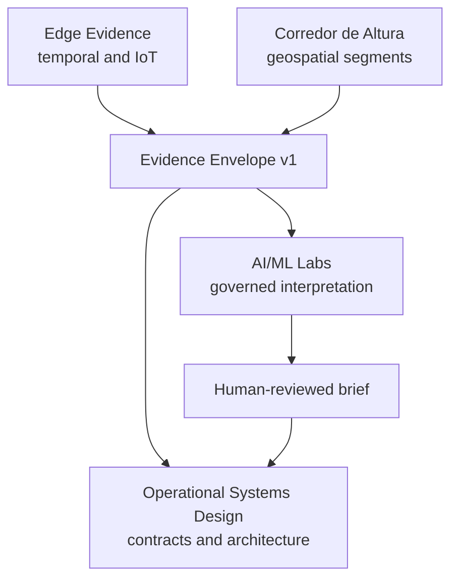

# Portfolio System of Systems v1

## Architectural intent

The portfolio is a set of independently useful systems connected by evidence,
not one monolithic application. Each repository retains its own lifecycle,
tests, releases and non-claims. Interoperability occurs through the versioned
Operational Evidence Envelope.

## Component responsibilities

| Component | Owns | Does not own |
|---|---|---|
| Edge Operational Evidence System | Events, ledgers, replay, edge transport evidence and M9A qualification | Geospatial interpretation or final operational decisions |
| Corredor de Altura | Segment geometry, calibrated spatial features, relative exposure and change evidence | Live device continuity or safety authorization |
| AI/ML Systems Architecture Labs | Evidence validation, typed claims, abstention, semantic guards and audit records | Producer truth, unrestricted retrieval or actuator authority |
| Operational Systems Design | Cross-repository contracts, architecture, learning narrative and portfolio cases | Reimplementing producer pipelines |
| LUTMAR, future | Vendor-agnostic service packaging and client-specific integration | Replacing OEM, sensor or corporate source systems |

Crypto Alpha OS remains outside this topology until it has a genuine
operational-evidence use case. Similar technology alone is not a sufficient
reason to couple systems.

## End-to-end evidence path

1. A producer creates or derives evidence inside its own boundary.
2. The producer exports a public or sanitised envelope pinned to a revision.
3. A consumer validates schema, classification, integrity metadata and scope.
4. AI may propose typed claims but cannot rewrite the evidence.
5. Deterministic controls validate citations and supported values.
6. A human reviews the resulting brief and retains decision authority.
7. The audit record preserves the path back to the producer artifact.

## Coupling rules

- Repositories depend on the contract, not on each other's internal modules.
- Producers never import AI consumer code to create evidence.
- Consumers never write back into producer evidence.
- A simulated source is labelled at the producer boundary and cannot be
  relabelled as observed downstream.
- Cross-repository changes use linked issues and explicit compatibility notes.

## Failure containment

| Failure | Containment |
|---|---|
| Producer changes internal storage | Envelope exporter absorbs the change |
| Consumer does not support a schema version | Envelope is rejected explicitly |
| Model invents or alters a fact | Typed semantic validation rejects it |
| Evidence is stale or conflicting | Brief is qualified, rejected or abstained |
| Private data reaches a public exporter | Classification and boundary validation fail closed |
| One repository becomes unavailable | Pinned revision and artifact identity remain in provenance |

## Evolution path

1. Publish and review Envelope v1 in the central architecture repository.
2. Add an Edge M9A exporter and contract test.
3. Add a clearly simulated Corredor segment-change exporter.
4. Make Lab 03 consume both producer profiles through the same envelope.
5. Publish an integrated human-reviewed case without claiming operational
   authority.
